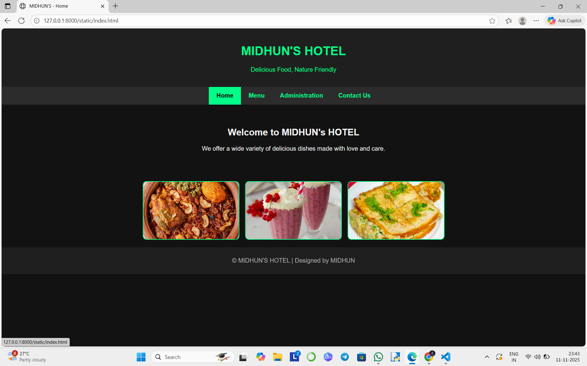
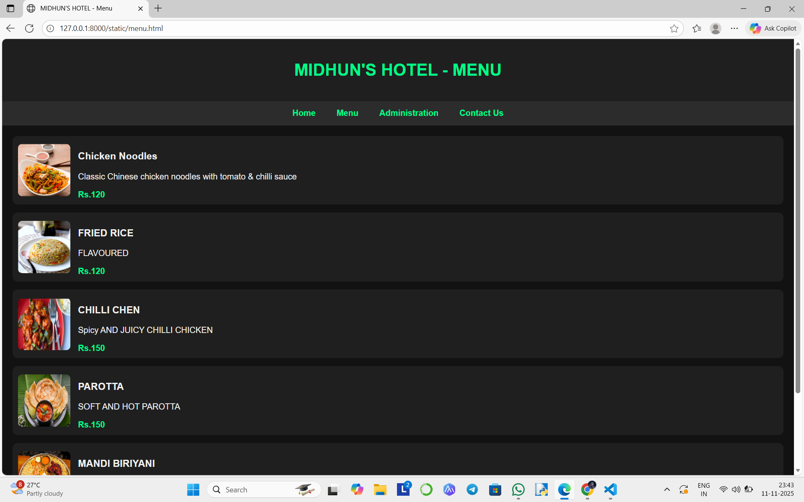
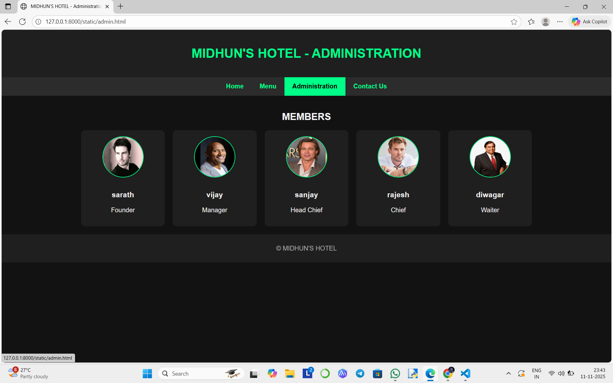
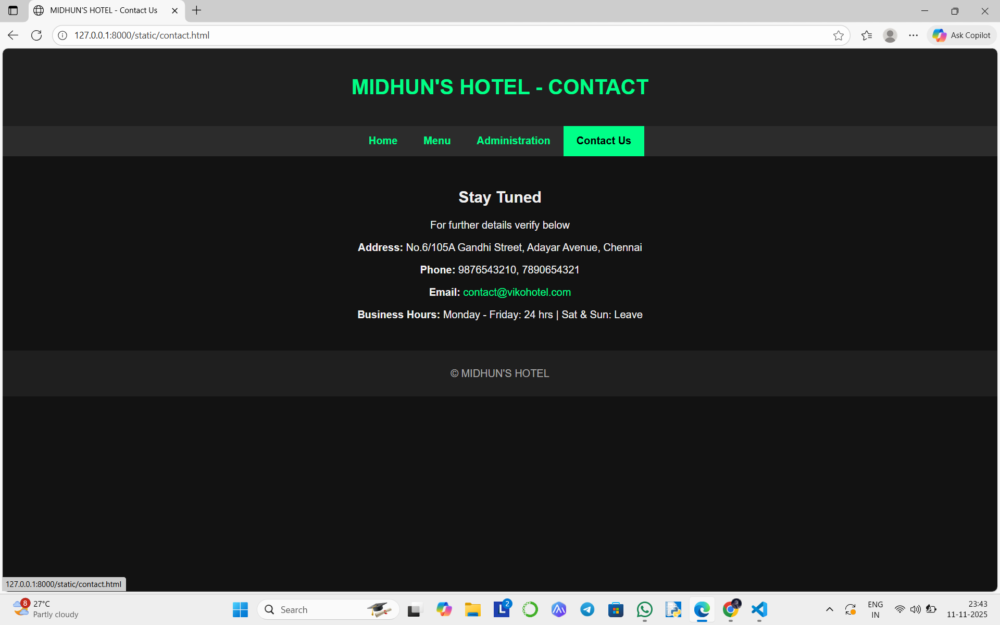

# Ex.07 Restuarant Website
## Date:

## AIM:
To develop a static Resturant website to display the menu and services provided by the resturant.

## DESIGN STEPS:

### Step 1:
Requirement collection.

### Step 2:
Creating the layout using HTML and CSS.

### Step 3:
Updating the sample content.

### Step 4:
Choose the appropriate style and color scheme.

### Step 5:
Validate the layout in various browsers.

### Step 6:
Validate the HTML code.

### Step 7:
Publish the website in the given URL.

## PROGRAM:
## ADMIN PAGE:
```
<!DOCTYPE html>
<html lang="en">
<head>
    <meta charset="UTF-8">
    <meta name="viewport" content="width=device-width, initial-scale=1.0">
    <title>MIDHUN'S HOTEL - Administration</title>
    <style>
        body {
            margin: 0;
            font-family: Arial, sans-serif;
            background-color: #121212;
            color: #f0f0f0;
        }
        header {
            background-color: #1f1f1f;
            color: #00ff88;
            text-align: center;
            padding: 20px;
        }
        nav {
            display: flex;
            justify-content: center;
            background-color: #2c2c2c;
        }
        nav a {
            color: #00ff88;
            text-decoration: none;
            padding: 14px 20px;
            font-weight: bold;
        }
        nav a:hover {
            background-color: #00ff88;
            color: #000;
        }
        section {
            padding: 20px;
        }
        .admin-list {
            display: flex;
            flex-wrap: wrap;
            justify-content: center;
            gap: 20px;
        }
        .admin-item {
            background-color: #1f1f1f;
            border-radius: 10px;
            padding: 15px;
            width: 180px;
            text-align: center;
        }
        .admin-item img {
            width: 100px;
            height: 100px;
            border-radius: 50%;
            margin-bottom: 10px;
            border: 2px solid #00ff88;
        }
        footer {
            background-color: #1f1f1f;
            color: #aaa;
            text-align: center;
            padding: 10px;
        }
    </style>
</head>
<body>

<header>
    <h1>MIDHUN'S HOTEL - ADMINISTRATION</h1>
</header>

<nav>
    <a href="index.html">Home</a>
    <a href="menu.html">Menu</a>
    <a href="admin.html">Administration</a>
    <a href="contact.html">Contact Us</a>
</nav>

<section>
    <h2 style="text-align:center;">MEMBERS</h2>
    <div class="admin-list">
        <div class="admin-item">
            
            <h3>sarath</h3>
            <p>Founder</p>
        </div>

        <div class="admin-item">
            
            <h3>vijay</h3>
            <p>Manager</p>
        </div>

        <div class="admin-item">
            
            <h3>sanjay</h3>
            <p>Head Chief</p>
        </div>

        <div class="admin-item">
            
            <h3>rajesh</h3>
            <p>Chief</p>
        </div>

        <div class="admin-item">
            
            <h3>diwagar</h3>
            <p>Waiter</p>
        </div>
    </div>
</section>

<footer>
    <p>&copy; MIDHUN'S HOTEL</p>
</footer>

</body>
</html>
```
## MENU PAGE:
```
<!DOCTYPE html>
<html lang="en">
<head>
    <meta charset="UTF-8">
    <meta name="viewport" content="width=device-width, initial-scale=1.0">
    <title>MIDHUN'S HOTEL - Menu</title>
    <style>
        body {
            font-family: Arial, sans-serif;
            background-color: #121212;
            color: #f0f0f0;
            margin: 0;
        }
        header {
            background-color: #1f1f1f;
            text-align: center;
            padding: 20px;
            color: #00ff88;
        }
        nav {
            display: flex;
            justify-content: center;
            background-color: #2c2c2c;
        }
        nav a {
            color: #00ff88;
            text-decoration: none;
            padding: 14px 20px;
            font-weight: bold;
        }
        nav a:hover {
            background-color: #00ff88;
            color: #000;
        }
        section {
            padding: 20px;
        }
        .menu-item {
            display: flex;
            align-items: center;
            background-color: #1f1f1f;
            margin-bottom: 15px;
            border-radius: 10px;
            padding: 10px;
        }
        .menu-item img {
            width: 100px;
            height: 100px;
            margin-right: 15px;
            border-radius: 8px;
        }
        .price {
            color: #00ff88;
            font-weight: bold;
        }
        footer {
            background-color: #1f1f1f;
            text-align: center;
            color: #aaa;
            padding: 10px;
        }
    </style>
</head>
<body>

<header>
    <h1>MIDHUN'S HOTEL - MENU</h1>
</header>

<nav>
    <a href="index.html">Home</a>
    <a href="menu.html">Menu</a>
    <a href="admin.html">Administration</a>
    <a href="contact.html">Contact Us</a>
</nav>

<section>
    <div class="menu-item">
        
        <div>
            <h3>Chicken Noodles</h3>
            <p>Classic Chinese chicken noodles with tomato & chilli sauce</p>
            <span class="price">Rs.120</span>
        </div>
    </div>

    <div class="menu-item">
        
        <div>
            <h3>FRIED RICE</h3>
            <p>FLAVOURED</p>
            <span class="price">Rs.120</span>
        </div>
    </div>

    <div class="menu-item">
        
        <div>
            <h3>CHILLI CHEN</h3>
            <p>Spicy AND JUICY CHILLI CHICKEN</p>
            <span class="price">Rs.150</span>
        </div>
    </div>

    <div class="menu-item">
        
        <div>
            <h3>PAROTTA</h3>
            <p>SOFT AND HOT PAROTTA</p>
            <span class="price">Rs.150</span>
        </div>
    </div>

    <div class="menu-item">
        
        <div>
            <h3>MANDI BIRIYANI</h3>
            <p>SEASONED AND FLAVOURED MANDI</p>
            <span class="price">Rs.200</span>
        </div>
    </div>

</section>

<footer>
    <p>&copy; MIDHUN'S HOTEL</p>
</footer>

</body>
</html>
```
## INDEX PAGE:
```
<!DOCTYPE html>
<html lang="en">
<head>
    <meta charset="UTF-8">
    <meta name="viewport" content="width=device-width, initial-scale=1.0">
    <title>MIDHUN'S - Home</title>
    <style>
        body {
            margin: 0;
            font-family: Arial, sans-serif;
            background-color: #121212;
            color: #f0f0f0;
        }
        header {
            background-color: #1f1f1f;
            padding: 20px;
            text-align: center;
            color: #00ff88;
        }
        nav {
            display: flex;
            justify-content: center;
            background-color: #2c2c2c;
        }
        nav a {
            color: #00ff88;
            text-decoration: none;
            padding: 14px 20px;
            display: block;
            font-weight: bold;
        }
        nav a:hover {
            background-color: #00ff88;
            color: #000;
        }
        .intro {
            text-align: center;
            padding: 40px 20px;
        }
        .gallery {
            display: flex;
            flex-wrap: wrap;
            justify-content: center;
            gap: 15px;
            padding: 20px;
        }
        .gallery img {
            width: 250px;
            height: 150px;
            border-radius: 10px;
            object-fit: cover;
            border: 2px solid #00ff88;
        }
        footer {
            background-color: #1f1f1f;
            color: #aaa;
            text-align: center;
            padding: 10px;
        }
    </style>
</head>
<body>

    <header>
        <h1>MIDHUN'S HOTEL</h1>
        <p>Delicious Food, Nature Friendly</p>
    </header>

    <nav>
        <a href="index.html">Home</a>
        <a href="menu.html">Menu</a>
        <a href="admin.html">Administration</a>
        <a href="contact.html">Contact Us</a>
    </nav>

    <div class="intro">
        <h2>Welcome to MIDHUN's HOTEL</h2>
        <p>We offer a wide variety of delicious dishes made with love and care.</p>
    </div>

    <div class="gallery">
        
        
        
    </div>

    <footer>
        <p>&copy; MIDHUN'S HOTEL | Designed by MIDHUN</p>
    </footer>

</body>
</html>
```
## CONTACT PAGE:
```
<!DOCTYPE html>
<html lang="en">
<head>
    <meta charset="UTF-8">
    <meta name="viewport" content="width=device-width, initial-scale=1.0">
    <title>MIDHUN'S HOTEL - Contact Us</title>
    <style>
        body {
            background-color: #121212;
            color: #f0f0f0;
            font-family: Arial, sans-serif;
            margin: 0;
        }
        header {
            background-color: #1f1f1f;
            color: #00ff88;
            text-align: center;
            padding: 20px;
        }
        nav {
            display: flex;
            justify-content: center;
            background-color: #2c2c2c;
        }
        nav a {
            color: #00ff88;
            text-decoration: none;
            padding: 14px 20px;
            font-weight: bold;
        }
        nav a:hover {
            background-color: #00ff88;
            color: #000;
        }
        section {
            padding: 30px;
            text-align: center;
        }
        a {
            color: #00ff88;
            text-decoration: none;
        }
        footer {
            background-color: #1f1f1f;
            color: #aaa;
            text-align: center;
            padding: 10px;
        }
    </style>
</head>
<body>

<header>
    <h1>MIDHUN'S HOTEL - CONTACT</h1>
</header>

<nav>
    <a href="index.html">Home</a>
    <a href="menu.html">Menu</a>
    <a href="admin.html">Administration</a>
    <a href="contact.html">Contact Us</a>
</nav>

<section>
    <h2>Stay Tuned</h2>
    <p>For further details verify below</p>

    <div class="contact-info">
        <p><strong>Address:</strong> No.6/105A Gandhi Street, Adayar Avenue, Chennai</p>
        <p><strong>Phone:</strong> 9876543210, 7890654321</p>
        <p><strong>Email:</strong> <a href="mailto:contact@vikohotel.com">contact@vikohotel.com</a></p>
        <p><strong>Business Hours:</strong> Monday - Friday: 24 hrs | Sat & Sun: Leave</p>
    </div>
</section>

<footer>
    <p>&copy; MIDHUN'S HOTEL</p>
</footer>

</body>
</html>
```
## OUTPUT:




## RESULT:
The program for designing software company website using HTML and CSS is completed successfully.
